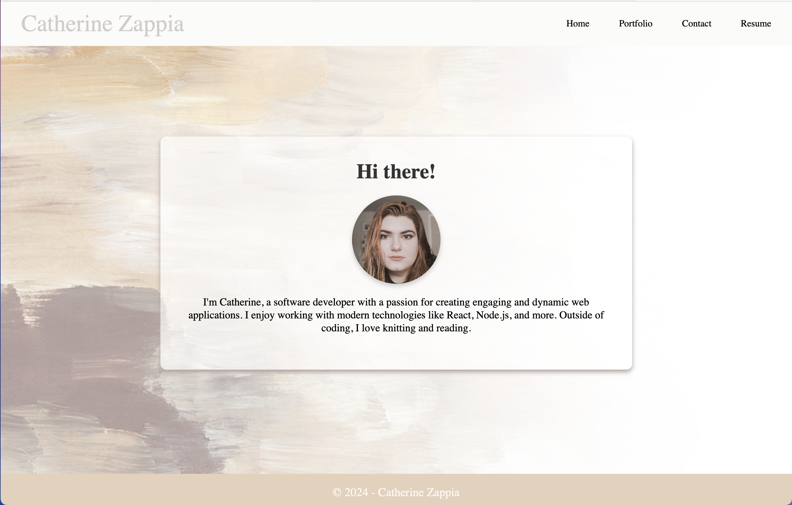

# React_2My_Portfolio
a portfolio created with React. 

## Description
- **I had to drag and drop my dist folder to deploy, as I keep running into a build error with my app.jsx file and my build command. this means the site is not set up for continuous deployment.**
- this took me a while to get right and a lot of trial and error when it comes to deploying to netlify.
- I am only a little sad that the font I picked didn't carry over to deployment. 

## Table of Contents
- [Usage](#usage)
- [License](#license)
- [Authors](#authors)
- [Features](#features)

## Usage

## License

---

## Authors
Catherine Zappia | [Github](https://www.github.com/catzappia)   [e-mail](catherinemzappia@gmail.com)

## Features

a vite+react app that contains an about me section (home), my project portfolio, a contact form, and my resume.
Its deployed via Netlify. 
If you made it this far, the missing font was "baloo".
